# Final Report

*Dalip Bachu*

Understanding the differences between the variance in the difficulties
of recreating the resources shown in the document
<https://mathcentre.ac.uk/resources/uploaded/mc-ty-trigratiosanysize-2009-1.pdf>

## Classification of difficulty of conversion.

### Easy: 

{width="6.268055555555556in"
height="2.6631944444444446in"}
This is the original static image of the
sin graph. Recreating this within Desmos is an easy task, as Desmos is
very intuitive. It does not need to look exactly as it does in the
original resource -- the main goal for it is to be accessible. Shown
below is my example resource for the recreated sin.

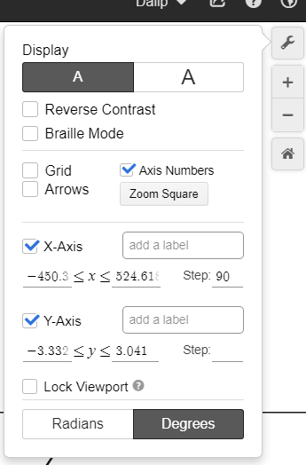{width="1.89375in"
height="2.876388888888889in"}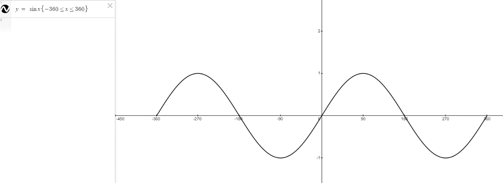{width="6.268055555555556in"
height="2.290277777777778in"}
Naming the graph as "graph of sine x" is useful, as the screen reader will read it out literally as it is
spelled. Having as few components as possible on the left-hand side
makes it the most accessible, as there is not too much to output from
the screen reader. Having a \<= sign creates a less than or equal to
sign, this is useful to know. Having the x axis scale in 90 is done by
clicking the spanner in the top right corner and writing 90 in step. An
example of how to do this is shown on the right.

### Medium:

{width="6.268055555555556in"
height="2.2381944444444444in"}

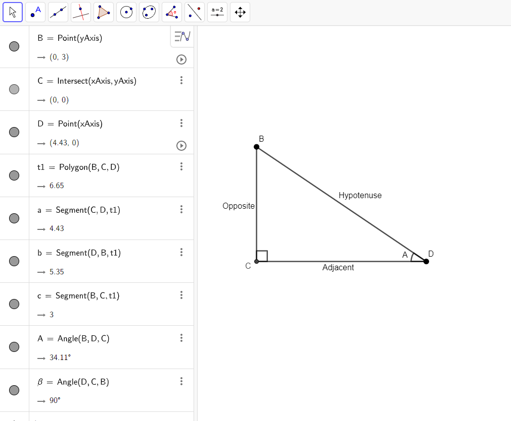{width="6.268055555555556in"
height="5.176388888888889in"}
This is an example of one of the resources
that is of medium difficulty to recreate in GeoGebra. As I had no
experience using GeoGebra in the past, I first created this resource
using text to describe each of the edges, rather than using the in-built
captioning feature which is more useful for a visually impaired person.
Also, having each point on the corners visible is more accessible, as it
reads them out as well as the segments between the points. The main
difficulty I found was finding the words to describe a triangle to a
visually impaired person. <https://poet.diagramcenter.org/index.html>
helped, along with reading the text around the image in the page, so I
knew what to include and what has already been said.

### Hard:

The most difficult type of resource I found to make was the dynamic
images of the moving sin, cos and tan graphs. The example of how the tan
graph is in the current pdf is shown below.

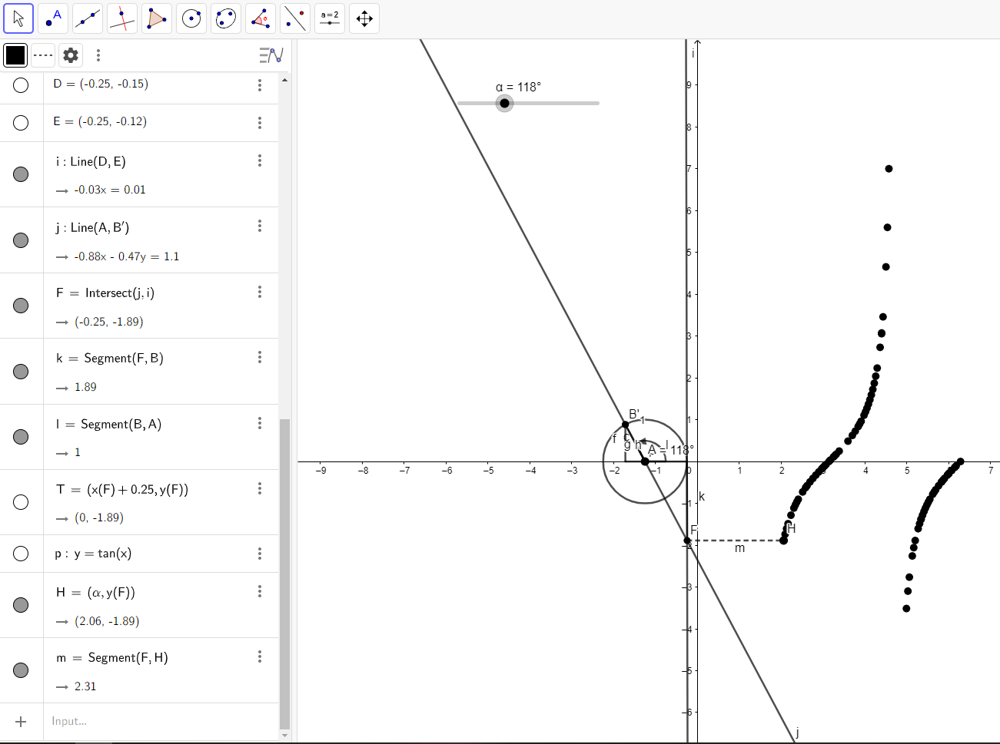{width="6.200694444444444in"
height="4.618055555555555in"}{width="6.268055555555556in"
height="2.7381944444444444in"}
My first attempt to recreate the tan graph and where it is derived from is shown below.

<https://www.geogebra.org/classic/vjwfw2tr>

This was not easily accessible, as there are too many components to
create the graph. They would all be read out one by one. I thought there
was an opportunity to suppress the outputs of some components that
weren't necessary by marking them as auxiliary objects, however the
screen reader reads them from the graphics view rather than the algebra
view. I also thought it would be necessary to show where the x
co-ordinates come from in the tan graph.

We decided that creating the simplest possible resource with the fewest
number of components would be more accessible, as the screen reader
reads each individual component. Also, discovered that you can use two
different graphics views with one algebra view, so you can decide in
which graphics view a point goes. Shown below is the tan graph.

{width="6.268055555555556in"
height="2.9881944444444444in"}

<https://www.geogebra.org/classic/bnwvnbrc>

## Things I wish I knew before creating the resources:

### Top tips

-   Familiarise yourself with how to describe a mathematical resource
    before you create a resource, using
    <https://poet.diagramcenter.org/>

-   Take the time to understand how to use multiple graphics views in
    GeoGebra before jumping in to create resources.

-   Creating a dynamic resource in GeoGebra is significantly more
    difficult than creating a static image (especially if you're using
    multiple graphics views).

-   Use the minimum number of components when creating a GeoGebra
    resource -- the screen reader will read out every single component
    and there is not a way to suppress the information being read out.

    -   Marking things as auxiliary objects does not work -- they hide
        them from the algebra view but when navigating through the
        graphics views they get read out.

-   Use the in-built captioning features to describe an edge or a point
    is more accessible than creating text, as a visually impaired person
    will probably not be able to figure out which text is corresponding
    to which component.

-   Use the captioning to describe certain points to make them more
    accessible.

-   Use the points of an object to create an angle, as using the angle
    between lines feature in GeoGebra is unpredictable.

-   Creating the resources in a certain order is more accessible,
    despite it potentially not being the most logical way to create the
    resource.

    -   An example of this will be shown later in the document.

-   It is not always necessary to create a perfect recreation of the
    original image -- a simpler looking but more accessible resource is
    more important than keeping the image exact.

-   Read the text surrounding the image so you know what information is
    vital to put in the resource, and what is not necessary.

-   The workarounds (like creating an arrow with a vector and an arc)
    are not useful for a visually impaired person.

-   If you want to change the order components are read out in -- go in
    construction protocol where you can move things around (be careful
    with dependencies).

-   Use {} in Desmos to define where you want the function to start and
    finish.

-   Use \<= to create the or equal to signs.

### Logical vs Accessible:

Since in geogebra the tab order is defined by the order of object
creation sometimes, the most logical way to create a resource is not the
most accessible way to create the resource. An example of this is shown
below.

{width="6.268055555555556in"
height="3.1305555555555555in"}

Here is an example of a point P which moves around the circle C. The
most logical way to create this type of resource, I found, was as
follows:

1.  Create point O

2.  Create circle

3.  Create point P

4.  Create point A on the x axis

5.  Create point B on the y axis

6.  Create angle AOP

7.  Create right angle OAP

8.  Create line OA

9.  Create line AP

10. Create line BP

An alternative method to create this resource is the one I used as shown
in the image above:

1.  Create point O on the origin (because of the dependencies this must
    be made first)

2.  Create the circle c centred on the origin having radius 1

3.  Create point P on the diameter of the circle

4.  Create the line segment between points O and P -- this makes it
    clear that the segment is between the origin and the point just
    created.

5.  Create point A which uses the x value of the point P

6.  Create segment AP which uses the point just created

7.  Create segment AO which again uses point A

8.  Create the angles between the segments (OAP and AOP)

9.  Create the final point B (it is hidden here) which uses the y value
    of the point P

10. Create the final segment BP as the point B has just been created.

### Comparing accessibilities between original and simplified tan graphs

I have created two videos of each tan graph, demonstrating how the
screen reader interacts with them. For the initial Tan graph I made, the
screen reader takes approximately 4:30 just to read out each component
of the graph. To interact with the slider, using the screen reader, you
can press the space bar for the angle to change around the origin. It
attempts to read out the angle of the point while it is changing, so
therefore it says "Graphics view 1" over and over until the slider is
paused.

For the simplified (and more accessible tan graph) for the screen reader
to interact with every component, it took 1:10. This is significantly
less than the time it took for the alternative tan graph. I think this
would be easier to understand for a visually impaired person, as there
is a lot less unnecessary information being read out to them. For a
visually impaired person to interact with the point B on this tan graph,
they can use the plus and minus arrows on the keyboard and move through
it in their own time. They could also see where the corresponding point
D is on Graphics View 2 for wherever they place B, and notice the
behaviour of the point D, when B is changed.

The simplified version of each of the Sin, Cos, and Tan graphs I found
to be more accessible, as they made more logical sense to me as I was
experimenting with the screen reader.

### A perfect recreation is not necessary

{width="3.192361111111111in"
height="2.647222222222222in"}
Initially, I thought it would be best to
create an accessible recreation of the resources that are already made.
This was because I felt that the text surrounding the objects, used to
describe it, would not make sense if the resource isn't an exact match
to what it was before. This caused me to create some workarounds --
which were both not necessary and not accessible. Shown below is how the
original static resource was shown on the document.

Below is my first attempt to make this a dynamic resource.

{width="3.251023622047244in"
height="2.6692607174103236in"}

I created this and it became a dynamic resource, but I then tested it
with a screen reader, and I discovered that it is not an accessible
resource for a visually impaired person. This is because I used a
workaround in order to get the large arrow around the outside of the
circle. I made it by creating a circular arc around the outside and
attached a very small vector to it. It is made up of two components. The
screen reader reads out each component one at a time, and although the
vector starts from a similar point to where the arc is, they are not
connected so it would be difficult for a visually impaired person to
understand that I was trying to create an arrow.

{width="2.507919947506562in"
height="2.2376060804899387in"}

This is the final, simplified version of the image. After realising the
arrow wasn't necessary (especially because there is an arrow in the
angle to show which way it is being measured) I decided to get rid of
it. This makes it more accessible to a visually impaired person, as
there is now less components being read out by the screen reader.

## Adding Geogebra to a HTML document

### HTML embed code:

Using the links to transfer across the GeoGebra resources I created
proved to be difficult when embedding them into the accessible HTML
file. A way to overcome this is for the person who created the resource
(me in this case) to tidy it up, by first removing the Algebra view,
followed by resizing both of the graphics views by zooming in or out.
Following this, save the resource into the account of the user and close
it. Then, open GeoGebra's home page and go to the resources page,
followed by clicking "mine" so you can open the resource that you have
just saved. Next, click the three vertical dots in the top right corner
and select details. This will take you to a different page where you can
click share and them embed so you can copy and paste the HTML code.

1.  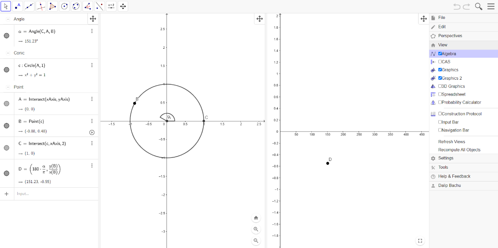{width="5.84375in"
    height="2.9125in"}Unselect "Algebra" shown below. This will remove
    the left most column where the description of each component is
    shown.

2.  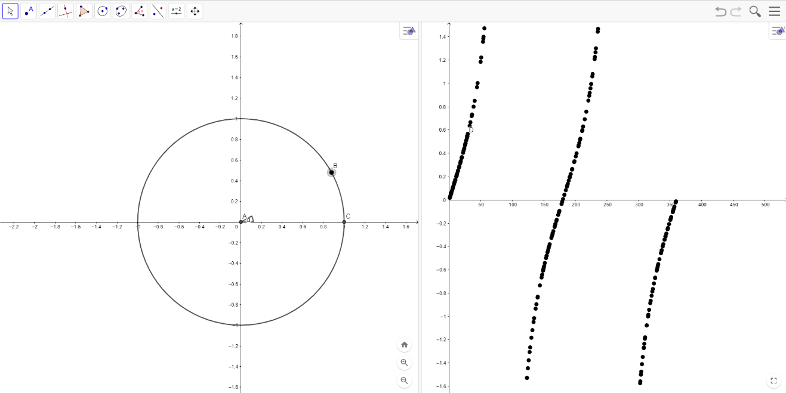{width="5.989583333333333in"
    height="2.9944444444444445in"}If necessary, adjust the zoom levels
    of each of the views separately. This can be done by using the
    scroll wheel or the magnifying glass buttons at the bottom right of
    the views. You can also adjust the positioning of both views here by
    dragging the backgrounds around. The resource should now look like
    this.

3.  Save the resource to your account and close the tab.

4.  Go to geogebra.org and select resources.

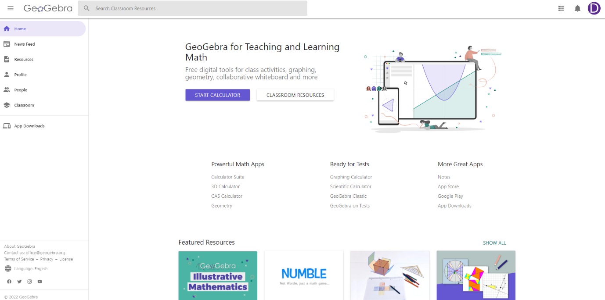{width="6.418055555555555in"
height="3.111111111111111in"}

5.  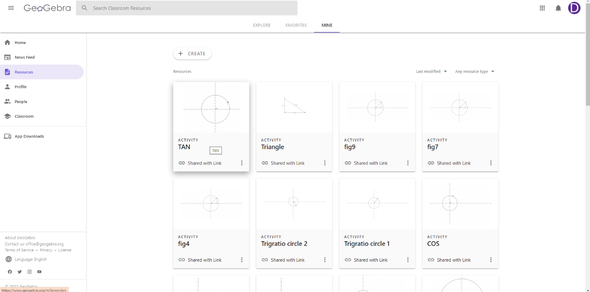{width="6.268055555555556in"
    height="3.1041666666666665in"}Select "mine" in the top bar and
    select the resource to open it.

6.  Click the three dots in the top right corner of the page and select
    details

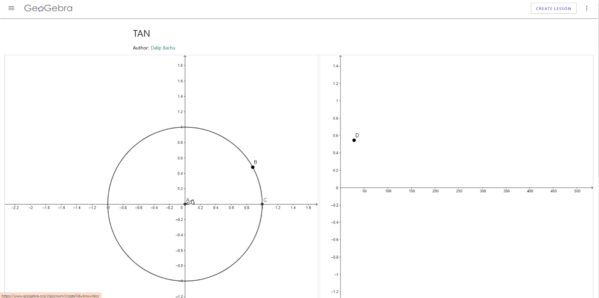{width="6.268055555555556in"
height="3.158333333333333in"}

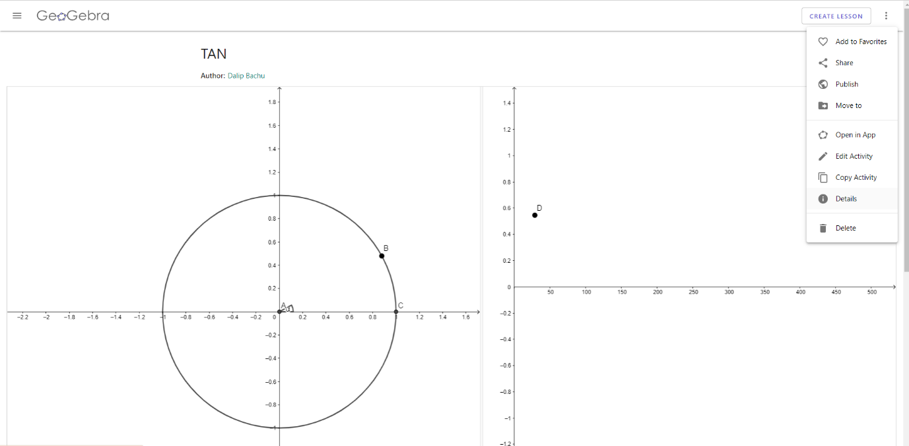{width="6.268055555555556in"
height="3.0833333333333335in"}
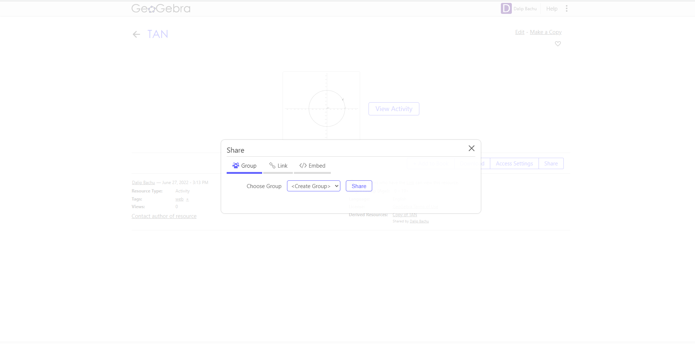{width="6.268055555555556in"
height="3.1055555555555556in"}

7.  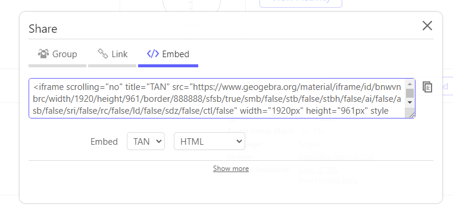{width="6.268055555555556in"
    height="2.972916666666667in"}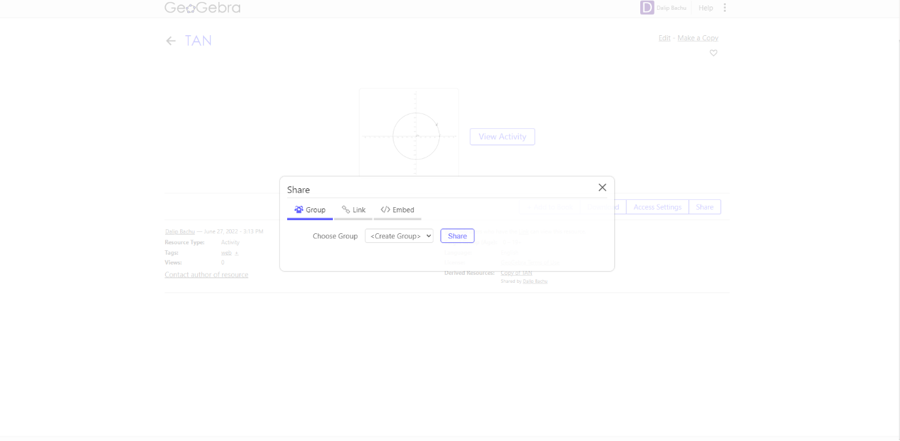{width="6.268055555555556in"
    height="3.077777777777778in"}{width="6.268055555555556in"
    height="3.082638888888889in"}
    Click "share" followed by the "Embed"
    button and copy the code to paste.

8.  To make the applet responsive one method it to use bootstrap
    stylings. Remove the width="1920px" height="961px" and wrap it in a
    div with class=\"embed-responsive embed-responsive-16by9\" so the
    applet can rescale so it can be used on a phone.

Resizing the GeoGebra file after embedding:

It is likely that the GeoGebra "applets" will need resizing once you
have written the code. The easiest way to do this is to resize the
resources on each graphics views and then save it. The code (which will
remain the same) will then access the original resource through GeoGebra
to then display the most recent save of the resource.

### Disabling pan and zoom on GeoGebra applets:

1.  Go to geogebra.org and select "resources" on the left followed by
    "mine" and select the resource you wish to disable the pan and zoom
    feature on.

2.  In the top right, select the three vertical dots button and select
    edit activity.

3.  Then select the pencil icon at the top of the applet, as
    demonstrated by the picture below.

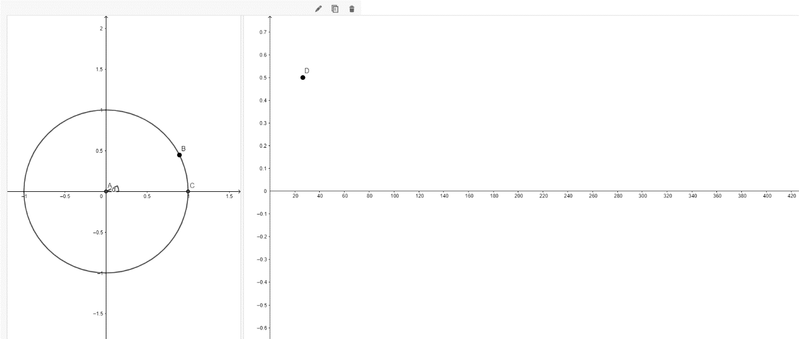{width="3.373611111111111in"
height="2.720833333333333in"}

4.  Then scroll down to advanced settings and click the box that says
    enable pan and zoom to unselect it.

5.  {width="6.268055555555556in"
    height="2.7729166666666667in"}
    Select save changes and close.

## Desmos:

Desmos is straight forward to use, the documentation is good and it
lends itself to easy diagrams. Here are some tips for using it.

### Defining a function over a range.

In order to define a function over a certain range, use {} after the
function. An example is shown below.

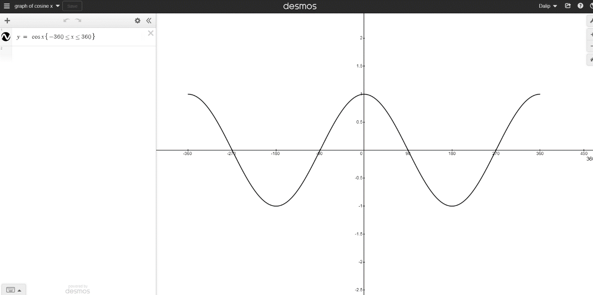{width="6.260416666666667in"
height="3.120498687664042in"}

### Naming graphs

Name the graph so when it is read out phonetically, the screen reader
will read it out similar to how it is pronounced. The above graph is
named "graph of cosine x" so it will make sense to a visually impaired
person when they are using the screen reader to interact with it.
