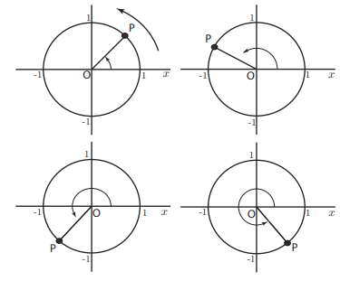
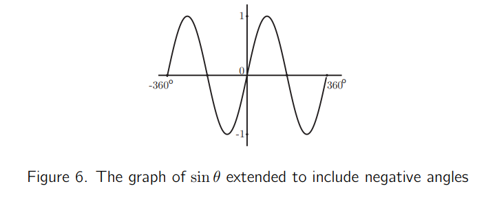

# Guiding Principles

## Maps not directions

Navigating from A to B if you go wrong on a set of directions your lost. However, if you have a map you've got a chance to find your way again. 

Creating an explorable digital object rather than writing alt text gives the user the opportunity to build a map of the image rather than someone else's interpretation of it.

Example: Geometric diagram.

{width="6.268055555555556in"
height="2.2381944444444444in"}

Creating a digital interactive geometric diagram allows the user to move between points themsleves and findout what is connected to what. 

## Simplify

> Our life is frittered away by detail... simplify, simplify.
>
> *Henry David Thoreau*

Personally I think one simplify would have done, but hey! Screen readers are verbose. Reducing screen clutter makes for a more pleasant experience. Some embleshments to diagrams that are neccessary when they are static pictures become obsolite once they become interactive. Take for example arrows to show movement. Once movement is possible is the arrow necessary. The best replacement for an image may not look 100% like the original image.

For example the arrows on this image.

{width="3.192361111111111in"
height="2.647222222222222in"}

Once the object becomes interactive they become irrelavent since the user can move the object themselves.

```{r, echo=FALSE}
knitr::include_url("https://www.geogebra.org/material/iframe/id/qqq2vrjp/width/1920/height/961/border/888888/sfsb/true/smb/false/stb/false/stbh/false/ai/false/asb/false/sri/false/rc/false/ld/false/sdz/false/ctl/false", height="300px")
```

## The wheel is already invented

Where possible use the in build functionality of the software being used to make digital objects. 

For example to recreate the tick marks on the following image. Three extra points would have to be added to the dirgram. This make more clutter for a screen reader user.

{width="6.268055555555556in"
height="2.6631944444444446in"}

Using the *baked in* functionality of the software adds some extra tick marks but creates a much cleaner experience.

{width="6.268055555555556in"
height="2.290277777777778in"}
