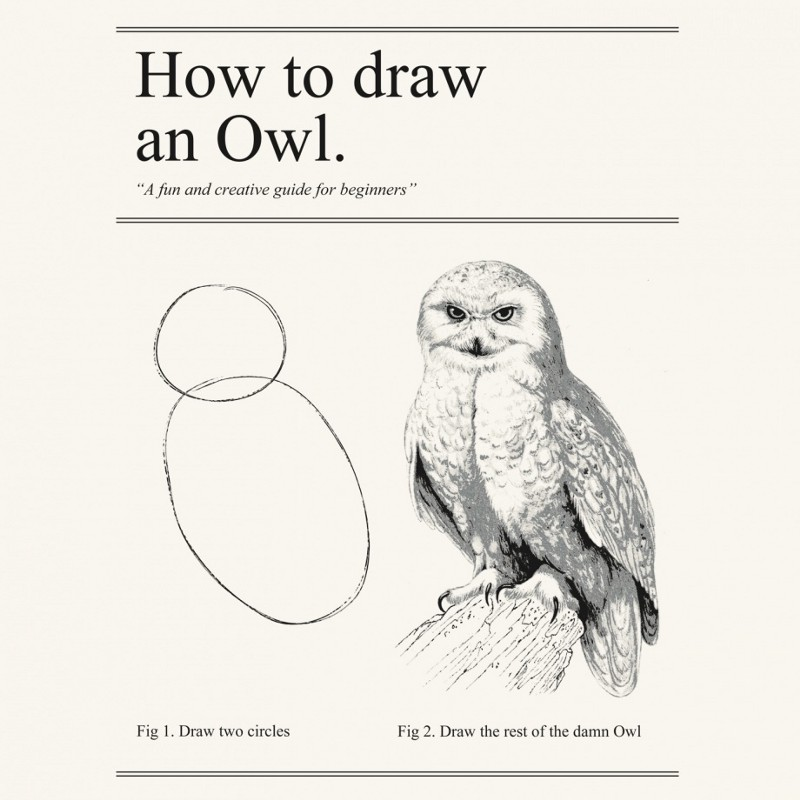

# GeoGebra useful techniques

GeoGebra is a powerful tool. However, expect to invest some time getting to grips with it to make the most out of using it.

See Dalip's notes in the final report for more detailed advice.

```{r, echo=FALSE}

```

## Make everyrhing twice

Since tab order follows construction order it's often useful to *sketch* the object on GeoGebra first. After you've got a feel for how the tab order flows, rebuild the object to create a nicer tab order.

## Expect to invest some time

GeoGebra is powerful, but with power comes complexity. Expect to spend a while figuring out how to use it. Getting clean embedable objects is a bit of a process at first.