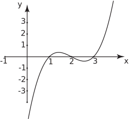

# Images in Mathcentre and HELM

The [mathcentre website](https://www.mathcentre.ac.uk/) now maintained by the [**sigma** network](http://www.sigma-network.ac.uk/) host support materials for anyone looking for post-16 maths help.

[HELM (Help Engineers Learn Maths)](https://github.bath.ac.uk/pages/MASH/HELM/) is a popular resource that has already been converted to HTML. The next stage now is to recreate the images as digital objects.

## Scale of the problem

There are over 1000 images embedded in the mathcentre resources. The HELM resources have about 900 images in them.  Most will be easy to recreate as a digital object. Some will be tricky here is a flavor of the type of object still to be done.

### Easy

Quickly done in desmos using one equation and some formatting options.

```{r, echo=FALSE}

```

### Medium

Can be done in desmos using more than one equation and formatting options.

```{r, echo=FALSE}
knitr::include_graphics("img/integ92Fig1.svg")
```

### Hard

Can only be done in geogebra. Will probably require making and then remaking to make an object that is easily navigable.

```{r, echo=FALSE}
knitr::include_graphics("img/vectors-scalarprod-fig5.svg")
```