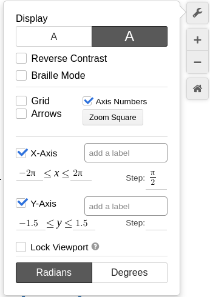
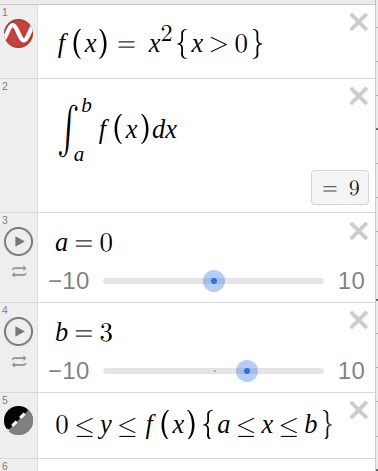

# Desmos useful techniques

Here are some useful techniques when using desmos.

## Removing clutter

By selecting a few options in desmos you can create really nice looking diagrams.

### $y = sin(x)$ with no formating

```{r, echo=FALSE}
knitr::include_url("https://www.desmos.com/calculator/qq0fjs6jvd")
```

This is was made by just entering the equation $y = sin(x)$ into desmos, saving it and copying the link `https://www.desmos.com/calculator/qq0fjs6jvd`.

### $y = sin(x)$ with formating

```{r, echo=FALSE}
knitr::include_url("https://www.desmos.com/calculator/usu3h5pyis?embed")
```

To limit the domain of the function we write. $y = sin(x) {-2\pi \le x \le 2\pi}$ which can be obtained by typing `y=sin(x){2pi<=x<=2pi}` into the desmos graphing calculator.

To streamline the look of the diagram the following options were used.

- large font
- deselect grid
- change x axis limits
- change y axis limits

You can get these by clicking on the spanner in the top right hand corner.

```{r, echo=FALSE}

```

## Showing areas under graphs

```{r, echo=FALSE}
knitr::include_url("https://www.desmos.com/calculator/losncepxjt?embed")
```

The following equations were used to make this.

- large font
- deselect grid
- change x axis limits
- change y axis limits

Adding the following equations gives you the desired result.

```{r, echo=FALSE}

```
