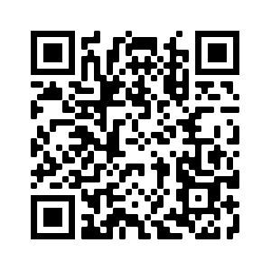

# How to help

Although not yet implimented, the procedure to help with the image conversion is outlined below:

- Images and links provided in a shared spreadsheet
- Members of the comminity create a digital object and place link in spreadsheet
- Object checked
- Objects inserted into the resources automatically

```{r echo=FALSE}
library(knitr)
csv_data = read.csv('csv/list_of_img.csv')
kable(csv_data, caption = "Example of spreadsheet")
```

Scan this to get the link to this:

```{r, echo=FALSE}

```
